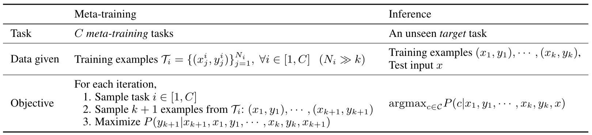
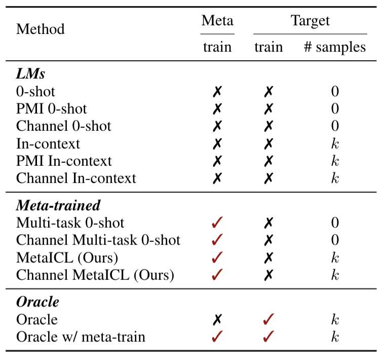

<<<<<<< HEAD
# Rethinking the Role of Demonstrations: What Makes In-Context Learning Work?

This includes an original implementation of "[Rethinking the Role of Demonstrations: What Makes In-Context Learning Work?][paper]" by [Sewon Min][sewon], [Xinxi Lyu][xinxi], [Ari Holtzman][ari], [Mikel Artetxe][mikel], [Mike Lewis][mike], [Hannaneh Hajishirzi][hanna], and [Luke Zettlemoyer][luke].

This code provides:
- Codes for creating the variants of the demonstrations used in the experiments.
- Commands to run the models and get numbers reported in the paper, based on the [MetaICL][metaicl] codebase.

Please leave issues for any questions about the paper or the code.

If you find our code or paper useful, please cite the paper:
```
@inproceedings{ min2022rethinking,
    title={ Rethinking the Role of Demonstrations: What makes In-context Learning Work? },
    author={ Min, Sewon and Lyu, Xinxi and Holtzman, Ari and Artetxe, Mikel and Lewis, Mike and Hajishirzi, Hannaneh and Zettlemoyer, Luke },
    booktitle={ EMNLP },
    year={ 2022 }
}
```

### Announcements
* 07/25/2022: The code also supports running GPT-3 now.
* 02/25/2022: The code supports running GPT-2, MetaICL and GPT-J for now. Please contact authors for running other models.

## Content

1. [Preparation](#preparation)
2. [Reproducing Main Experiments](#reproducing-main-experiments) (Section 4.1 of the paper)
    * [No Demonstrations](#no-demonstrations)
    * [Demonstrations with gold labels](#demonstrations-with-gold-labels)
    * [Demonstrations with random labels](#demonstrations-with-random-labels)
3. [Reproducing Ablations](#reproducing-ablations) (Section 4.2 of the paper)
    * [Number of correct labels](#number-of-correct-labels)
    * [Number of input-label pairs in the demonstrations](#number-of-input-label-pairs-in-the-demonstrations)
    * [Using manual templates](#using-manual-templates)
4. [Reproducing Analysis](#reproducing-analysis) (Section 5 of the paper)
    * [Demonstrations with OOD input text](#demonstrations-with-ood-input-text)
    * [Demonstrations with random english words](#demonstrations-with-random-english-words)
    * [Demonstrations with random labels only (no inputs)](#demonstrations-with-random-labels-only-no-inputs)
    * [Demonstrations with no labels (inputs only)](#demonstrations-with-no-labels-inputs-only)

## Preparation

The code is tested with python 3.8.

The data and the code are based on the MetaICL codebase.
```bash
git remote add metaicl https://github.com/facebookresearch/MetaICL.git
git pull metaicl main
```

Install the data dependencies and download the data.
```bash
conda conda create --name metaicl-data python=3.8
conda activate metaicl-data
pip install datasets==1.4.0 wget
cd preprocess
python _build_gym.py --build --n_proc=40 --do_test
```

This uses `k=16` by default. If you want to run ablations with varying `k`, please also run the following.
```bash
python _build_gym.py --build --n_proc=40 --do_test --test_k {4|8|32}
```

After preprocesisng is done, come back to the main directory.
```bash
cd ../
conda deactivate
```

Now, install the model dependencies to run the model. Please note that the Transformer version is not compatible to the datasets library used to download the data, so make sure to use a different environment.
```
conda conda create --name metaicl python=3.8
conda activate metaicl
=======
# MetaICL: Learning to Learn In Context

This includes an original implementation of "[MetaICL: Learning to Learn In Context][paper]" by [Sewon Min](http://shmsw25.github.io/), [Mike Lewis](https://ai.facebook.com/people/mike-lewis/), [Luke Zettlemoyer](https://www.cs.washington.edu/people/faculty/lsz) and [Hannaneh Hajishirzi](https://homes.cs.washington.edu/~hannaneh/).

<p align="center">
  
</p>

<p align="center" style="font-size: 200%">
   ✨ <b><em>Check out our demo at <a href="http://qa.cs.washington.edu:2021/" target="_blank">qa.cs.washington.edu:2021</a>!</em></b> ✨
</p>


This README is mainly for how to reproduce MetaICL and Channel MetaICL in the paper, but also describe how to reproduce our baselines, including Multi-task zero-shot and various raw LM methods.
All methods used in the paper are available in this repo (please see the below table).

<p align="center">
  
</p>


**Updates on 02/25/2022**: Our code has been updated in minor changes with (1) better preprocessing for poem_sentiment and superglue-copa datasets, and (2) some utilities added (specify `--dataset` for a single dataset experiment or for custom dataset).

**Updates on 01/10/2022**: Our code and checkpoints have been updated with a better preprocessing (using newlines instead of spaces, and removing BOS and EOS), which improves the performance by 1--4%. If you have downloaded checkpoints prior to 01/10/2022, make sure to re-download checkpoints and use the updated code. Stay tuned for the updated paper with more details and updated results. You can find the brief summary of the updated results in the [Result section](#results) of this README.


For any questions about the paper or the code, please contact the first author ([email](mailto:cs.washington.edu)) or leave issues.

If you find our code or paper useful, please cite the paper:
```
@inproceedings{ min2022metaicl,
  title={ Meta{ICL}: Learning to Learn In Context },
  author={ Min, Sewon and Lewis, Mike and Zettlemoyer, Luke and Hajishirzi, Hannaneh },
  booktitle={ NAACL-HLT },
  year={ 2022 }
}
```
<p align="center">
  
</p>

## Content

1. [Installation](#installation)
2. [Quick Start](#quick-start)
3. [Data](#data)
    - [How to download and preprocess](#how-to-download-and-preprocess)
4. [Training](#training)
5. [Inference](#inference)
6. [Results](#results)
7. [Downloading Checkpoints](#downloading-checkpoints)
    - [Simply reproducing all results in the paper](#simply-reproducing-all-results-in-the-paper)

## Installation

These are installation guidelines mainly for running baselines. Requirements for data are provided [here](#how-to-download-and-preprocess). All codes are tested with Python 3.8.

```
>>>>>>> ec0f1c199965f54d4b4d35556e5ca9ba0a6719ab
pip install torch==1.9.0
pip install git+https://github.com/huggingface/transformers.git@c37573806ab3526dd805c49cbe2489ad4d68a9d7
```

<<<<<<< HEAD
(Optional) Install OpenAI Python Library for running GPT-3
```
pip install openai
```

## Reproducing Main Experiments

This is for reproducing experiments in Section 4.1 of the paper.
Evaluation datasets are:
* Classification (16 datasets): `financial_phrasebank`,`poem_sentiment`,`glue-wnli`,`climate_fever`,`glue-rte`,`superglue-cb`,`sick`,`medical_questions_pairs`,`glue-mrpc`,`hate_speech18`,`ethos-national_origin`,`ethos-race`,`ethos-religion`,`tweet_eval-hate`,`tweet_eval-stance_atheism`,`tweet_eval-stance_feminist`
* Multi-choice (10 datasets): `quarel`,`openbookqa`,`qasc`,`commonsense_qa`,`ai2_arc`,`codah`,`superglue-copa`,`dream`,`quartz-with_knowledge`,`quartz-no_knowledge`

#### No Demonstrations

To run the evaluation of No-Demonstrations:

```bash
# Direct GPT-2 Large
python test.py --dataset {dataset} --gpt2 gpt2-large --method direct --out_dir out/gpt2-large --do_zeroshot
# Channel GPT-2 Large
python test.py --dataset {dataset} --gpt2 gpt2-large --method channel --out_dir out/gpt2-large --do_zeroshot
# Direct MetaICL
python test.py --dataset {dataset} --gpt2 metaicl --method direct --out_dir out/metaicl --do_zeroshot
# Channel MetaICL
python test.py --dataset {dataset} --gpt2 channel-metaicl --method channel --out_dir out/channel-metaicl --do_zeroshot
# Direct GPT-J
python test.py --dataset {dataset} --gpt2 gpt-j-6B --method direct --out_dir out/gpt-j --do_zeroshot
# Channel GPT-J
python test.py --dataset {dataset} --gpt2 gpt-j-6B --method channel --out_dir out/gpt-j --do_zeroshot
# GPT-3
python test_gpt3.py --dataset {dataset} --gpt3 {ada|babbage|curie|davinci} --method {direct|channel} --out_dir out/gpt3 --do_zeroshot --api {API key}
```
Note that `test.py` and `test_gpt3.py` does not support multi-gpu for inference.

Other useful flags:
* `--test_batch_size`: can be adjusted based on your GPU memory availability. With a 32GB GPU, you can use 64 for GPT-2 Large & MetaICL, and 16 for GPT-J **with no demonstrations**. Later, when you run the code **with demonstrations**, decreasing the batch size by 4 times typically works, e.g., 16 (GPT-2 Large & MetaICL) and 4 (GPT-J) with a 32GB GPU.
* `--log_file`: if you want to save logs in a file, you can specify the path to the log file.

Notes for running GPT-3:
* You can create/check your OpenAI API keys by visiting [this link](https://beta.openai.com/account/api-keys).
* Running with GPT-3 can be expensive, and different models of GPT-3 comes with different costs. Please check [this link](https://openai.com/api/pricing/) to evaluate the cost before running each experiment.
* The responses from the GPT-3 API are cached in the `out_dir`.

From now on, we will use the above commands as a default and tell you which flags you need to add.


#### Demonstrations with gold labels

Run the commands same as [default commands](#no-demonstrations) but add `--use_demonstrations --k 16 --seed 100,13,21,42,87`.

#### Demonstrations with random labels

Create the demonstrations with random labels via:
```bash
python create_data.py --variant random --dataset {dataset}
```
Then, run the commands same as [default commands](#no-demonstrations) but add `--use_demonstrations --k 16 --seed 100,13,21,42,87 --dataset {dataset}_random`.

## Reproducing Ablations

This is for reproducing experiments in Section 4.2 of the paper.
Evaluation datasets are:
* Classification (5 datasets): `poem_sentiment`,`glue-rte`,`sick`,`glue-mrpc`,`tweet_eval-hate`
* Multi-choice (4 datasets): `openbookqa`,`commonsense_qa`,`ai2_arc`,`superglue-copa`

#### Number of correct labels

Create the demonstrations with varying number of correct labels via:
```bash
python create_data.py --variant {75|50|25|0}_correct --dataset {dataset}
```
Then, run the commands same as [default commands](#no-demonstrations) but add `--use_demonstrations --k 16 --seed 100,13,21,42,87 --dataset {dataset}_{75|50|25|0}_correct`.

#### Number of input-label pairs in the demonstrations

(Note that you should have run preprocessing with varying `k` to run this ablation. If you have not done this, please re-visit the [Preparation](#preparation) section.)

Create the demonstrations with varying `k` via:
```bash
python create_data.py --variant random --dataset {dataset} --k {4|8|16|32}
```
Then, run the commands same as [default commands](#no-demonstrations) but add `--use_demonstrations --k {4|8|16|32} --seed 100,13,21,42,87 --dataset {dataset}_random`.

#### Using manual templates

Create the demonstrations with varying type of labels and inference method via:
```bash
python create_data.py --variant {gold|random}_w_template --dataset {dataset} --method {direct|channel}
```
Then, run the commands same as [default commands](#no-demonstrations) but add `--use_demonstrations --k 16 --seed 100,13,21,42,87 --dataset {dataset}_{gold|random}_w_template_{direct|channel}`.

## Reproducing Analysis

This is for reproducing experiments in Section 5 of the paper.
Evaluation datasets are:
* Classification (5 datasets): `poem_sentiment`,`glue-rte`,`sick`,`glue-mrpc`,`tweet_eval-hate`
* Multi-choice (4 datasets): `openbookqa`,`commonsense_qa`,`ai2_arc`,`superglue-copa`

#### Demonstrations with OOD input text

First, you need a corpus file in a .txt format, where each line is a sentence (in the plain text).
In the paper, we used samples from the English portion of CC News, which we are unable to release here.
Please visit [this link](https://commoncrawl.org/2016/10/news-dataset-available/) to learn more about how to download the CC News corpus.

Create the demonstrations with OOD input text via:
```bash
python create_data.py --variant ood_inputs --dataset {dataset} --corpus_path {corpus_path}
```
Then, run the commands same as [default commands](#no-demonstrations) but add `--use_demonstrations --k 16 --seed 100,13,21,42,87 --dataset {dataset}_ood_inputs`.

#### Demonstrations with random english words

Create the demonstrations with random English words as labels via:
```bash
python create_data.py --variant random_english_words --dataset {dataset}
```
Then, run the commands same as [default commands](#no-demonstrations) but add `--use_demonstrations --k 16 --seed {seed} --dataset {dataset}_random_english_words_seed={seed}`, where `seed` can be one of 100, 13, 21, 42, and 87.

#### Demonstrations with random labels only (no inputs)

Create the demonstrations with random labels only via:
```bash
python create_data.py --variant random_labels_only --dataset {dataset}
```
Then, run the commands same as [default commands](#no-demonstrations) but add `--use_demonstrations --k 16 --seed 100,13,21,42,87 --dataset {dataset}_random_labels_only`.

#### Demonstrations with no labels (inputs only)

Create the demonstrations with no labels via:
```bash
python create_data.py --variant no_labels --dataset {dataset}
```
Then, run the commands same as [default commands](#no-demonstrations) but add `--use_demonstrations --k 16 --seed 100,13,21,42,87 --dataset {dataset}_no_labels`.


[paper]: https://arxiv.org/abs/2202.12837
[sewon]: http://shmsw25.github.io/
[xinxi]: https://alrope123.github.io/
[ari]: https://ari-holtzman.github.io/
[mikel]: https://scholar.google.com/citations?user=N5InzP8AAAAJ&hl=en
[mike]: https://ai.facebook.com/people/mike-lewis/
[hanna]: https://homes.cs.washington.edu/~hannaneh/index.html
[luke]: https://www.cs.washington.edu/people/faculty/lsz

[metaicl]: https://github.com/facebookresearch/MetaICL
=======
To train the model, we use [an 8-bit optimizer](https://github.com/facebookresearch/bitsandbytes) and [mixed precision](https://github.com/NVIDIA/apex) that significantly save the memory. To use them, please use the following commands (but skip if you will run inference only using released checkpoints):
```
# For 8-bit optimization: see https://github.com/facebookresearch/bitsandbytes for more details
pip install -i https://test.pypi.org/simple/ bitsandbytes-cuda102 # modify based on your CUDA version

# For mixed precision training: see https://github.com/NVIDIA/apex for more details
# make sure your nvcc is working (e.g. `nvcc --version`)
cd .. # move outside of this project directory
git clone https://github.com/NVIDIA/apex
cd apex
pip install -v --disable-pip-version-check --no-cache-dir --global-option="--cpp_ext" --global-option="--cuda_ext" ./
cd ../MetaICL # come back to this project directory
```

## Quick Start

This is an example with a dataset `financial_phrasebank`.

First, prepare a list of training examples
```python
train_data = [{"input": INPUT_1, "output": OUTPUT_1},
              {"input": INPUT_2, "output": OUTPUT_2},
              ...
              {"input": INPUT_K, "output": OUTPUT_K}]
```

If you prefer, you can download our training data by running the command `python -m utils.download --demo_data` then loading the downloaded file as follows.
```python
with open("data/financial_phrasebank/financial_phrasebank_16_100_train.jsonl", "r") as f:
    train_data = []
    for line in f:
        train_data.append(json.loads(line))
```

Then, you can use our model as follows.
```python
from metaicl.data import MetaICLData
from metaicl.model import MetaICLModel

# Load the model
data = MetaICLData(method="channel", max_length=1024, max_length_per_example=256)
model = MetaICLModel()
model.load("channel-metaicl")
model.cuda()
model.eval()

# Make a prediction for `input1`
input1 = "Both operating profit and net sales for the six-month period increased as compared to the corresponding period in 2007."
data.tensorize(train_data, [input1], options=["positive", "neutral", "negative"])
prediction = model.do_predict(data)[0]
print (prediction) # positive

# Make another prediction for `input2`
input2 = "The deal will have no significant effect on the acquiring company's equity ratio."
data.tensorize(train_data, [input2], options=["positive", "neutral", "negative"])
prediction = model.do_predict(data)[0]
print (prediction) # neutral
```

## Data

As described in the paper, we use a collection of 142 tasks taken from [CrossFit][crossfit-paper] and [UnifiedQA][unifiedqa-paper].
We experiment with seven different settings, where there is no overlap in meta-training and target tasks. Download/Preprocessing guidelines are [here](#how-to-download-and-preprocess).

| Setting name | alias (for command) | # meta-train tasks | # meta-train examples | # target tasks |
|---|---|---|---|---|
| High Resource &#8594; Low Resource  | `hr_to_lr` | 61 | 819,200 | 26 |
| Classification &#8594; Classification | `class_to_class` | 43 | 384,022 | 20 |
| Non-Classification &#8594; Classification | `non_class_to_class` | 37 | 368,768 | 20 |
| QA &#8594; QA | `qa_to_qa` | 37 | 486,143 | 22 |
| Non-QA &#8594; QA | `non_qa_to_qa` | 33 | 521,342 | 22 |
| Non-NLI &#8594; NLI | `non_nli_to_nli` | 55 | 463,579 | 8 |
| Non-Paraphrase Detection &#8594; Paraphrase Detection | `non_paraphrase_to_paraphrase` | 59 | 496,106 | 4 |

To run experiments for each setting, use "alias (for command)" for commands in the [Training](#training) section and the [Inference](#inference) section.

All settings above do not use any templates/instructions. If you want to use instruction version as in ablations in the paper, use settings in the following table.

| Setting name | alias (for command) | # instructions / meta-train task | # meta-train tasks | # meta-train examples | # target tasks |
|---|---|---|---|---|---|
| High Resource &#8594; Low Resource without instructions  | `hr_to_lr_noinst` | 0 | 32 | 492,655 | 12 |
| High Resource &#8594; Low Resource with instructions (1 per task) | `hr_to_lr_inst` | 1 | 32| 492,655 | 12 |
| High Resource &#8594; Low Resource with instructions (all) | `hr_to_lr_inst_all` | 8.3 | 32 | 492,655 | 12 |

If you use these data resources, please make sure to cite [CrossFit][crossfit-paper] and [UnifiedQA][unifiedqa-paper].
```
@inproceedings{ ye2021crossfit,
    title={ {C}ross{F}it: A Few-shot Learning Challenge for Cross-task Generalization in NLP },
    author={ Ye, Qinyuan and Lin, Bill Yuchen and Ren, Xiang },
    booktitle={ EMNLP },
    year={ 2021 }
}
@inproceedings{ khashabi2020unifiedqa,
    title={ {U}nified{QA}: Crossing Format Boundaries With a Single QA System },
    author={ Khashabi, Daniel and Min, Sewon and Khot, Tushar and Sabharwal, Ashish and Tafjord, Oyvind and Clark, Peter and Hajishirzi, Hannaneh },
    booktitle={ Findings of EMNLP },
    year={ 2020 }
}
```
If you use the instruction version, please make sure to cite [the T0 paper][t0-paper].
```
@inproceedings{ sanh2022multitask,
    title={ Multitask Prompted Training Enables Zero-Shot Task Generalization },
    author={ Victor Sanh and Albert Webson and Colin Raffel and Stephen H. Bach and Lintang Sutawika and Zaid Alyafeai and Antoine Chaffin and Arnaud Stiegler and Teven Le Scao and Arun Raja and Manan Dey and M Saiful Bari and Canwen Xu and Urmish Thakker and Shanya Sharma and Eliza Szczechla and Taewoon Kim and Gunjan Chhablani and Nihal Nayak and Debajyoti Datta and Jonathan Chang and Mike Tian-Jian Jiang and Han Wang and Matteo Manica and Sheng Shen and Zheng Xin Yong and Harshit Pandey and Rachel Bawden and Thomas Wang and Trishala Neeraj and Jos Rozen and Abheesht Sharma and Andrea Santilli and Thibault Fevry and Jason Alan Fries and Ryan Teehan and Stella Biderman and Leo Gao and Tali Bers and Thomas Wolf and Alexander M. Rush },
    booktitle={ ICLR },
    year={ 2022 }
}
```

### How to Download and Preprocess

The code is modified from [the original CrossFit repo][crossfit-repo]. First, install requirements:

```
pip install datasets==1.4.0 wget
```
Warning: we found that `datasets==1.4.0` is not compatible with Transformers version we use for training and inference. Please use a separate environement for data preprocessing and model training/inference.

```
cd preprocess
# preprocess from crossfit
python _build_gym.py --build --n_proc=40 --do_test
python _build_gym.py --build --n_proc=40 --do_train # skip if you won't run training yourself
# preprocess from unifiedqa
python unifiedqa.py --do_train --do_test # skip `--do_train` if you won't run training yourself
```
By default, preprocessed data is saved at `data/`.

Additional flags:
- `train_k`: number of examples per task for meta-training tasks (16384 by default)
- `test_k`: number of examples per task for target tasks (16 by default)

If you want to use values that are different from default ones, please simply add the flag, e.g., `python _build_gym.py --build --n_proc=40 --do_test --test_k 4`.

#### Process instruction version
The instruction version is for settings using instructions. We use instructions from [BigScience PromptSource][t0-repo]. First, fetch instructions (prompts) from PromptSource by doing the following.

```
# assuming you are still inside `preprocess` directory
cd ../.. # go outside of your project directory
git clone https://github.com/bigscience-workshop/promptsource.git
cd promptsource
git checkout 4e67a38d9642bde222cb90e36e8a66fd6e4a861a
mv promptsource ../MetaICL/preprocess/ # move promptsource directory under `preprocess` directory
cd ../MetaICL/preprocess # comte back to `preprocess` directory
pip install pandas jinja2 "pyyaml>=5"
```

Note that this is a workaround that does not use python-pip to install the promptsource packages because it requires to use python<=3.7, while all other codes in this repo use python 3.8. If promptsource starts supporting python 3.8, please install the package following the guidelines in the [original repo][t0-repo].

Then, download the data via:
```
python _build_gym.py --build --n_proc=20 --do_test --inst
python _build_gym.py --build --n_proc=20 --do_train --inst # skip if you won't run training yourself
```

## Training

First, run the command to tensorize the text data and save them.
```
python train.py \
  --task $task --k 16384 --test_k 16 --seed 100 --use_demonstrations --method channel \
  --do_tensorize --n_gpu 8 --n_process 40
```
- `--task`: name of the setting, like `hr_to_lr`, `class_to_class`, `non_class_to_class`, etc
- `--k`: # of examples per meta-training task
- `--test_k`: # of examples to be used at inference
- `--seed`: data seed for training data
- `--method`: direct / channel
- `--n_gpu`: the number of gpus you will use for training
- `--n_process`: the number of processed for preprocessing

Then, run the following command to train the model.
```
python -m torch.distributed.launch --nproc_per_node=8 train.py \
  --task $task --k 16384 --test_k 16 --seed 100 --train_seed 1 --use_demonstrations --method channel --n_gpu 8 \
  --batch_size 1 --lr 1e-05 --fp16 --optimization 8bit-adam --out_dir checkpoints/channel-metaicl/$task
```

- `--fp16`: for mixed precision training
- `--optimization 8bit-adam`: for 8-bit approximations for Adam optimizer
- `--batch_size`: batch size per GPU; we use 1, so that the global batch size is 8
- `--num_training_steps`: number of training steps; 30000 by default
- `--log_file`: you can optionally specify this to save logs as a text file

Training takes around 4.5 hours

If you want to train Multi-task zero-shot model that is one of our baselines in the paper, you can use similar commands for both tensorizing and training, but without `--use_demonstrations` and `--test_k`. Training takes around 3 hours.


## Inference

```
python test.py --task $task --k 16 --split test --seed 100 --test_batch_size 16 \
    --method {channel|direct} --use_demonstrations \
    --out_dir checkpoints/metaicl/$task \
    --global_step 30000
```

Instead of specifying `--global_step`, you can specify `--checkpoint` for path to the checkpoint if you want to use checkpoint stored in somewhere else (for example, if you have downloaded the released checkpoints and want to use them).
*You must specify one of `checkpoint` and `global_step`.*

- `--seed`: seed for training data you will use at inference
- `--test_batch_size`: batch size for inference; you can use 16 with a 32GB GPU
- `--unseen_domain_only`: specify if you would like to run inference on unseen domain only
- `--log_file`: Similar to in training, specify the path to the file where you want to save logs


If you want to run inference for Multi-task zero-shot baseline, you can use a similar command but without `--use_demonstrations` and `--k`. For this baseline, you can use `--test_batch_size 64` with a 32GB GPU.

If you want to run raw LM baselines in the paper, you do not need to specify `--checkpoint` or `--global_step`. Instead, specify `--do_zeroshot`, and then:
- For 0-shot, run the command `--method direct`
- For PMI 0-shot, run the command using `--is_null`, and then run the command using `--use_calibration` (for both, with `--method direct`)
- For Channel 0-shot, run the command using `--method channel`
- For In-context/PMI In-context/Channel In-context, do the same as above except always adding `--use_demonstrations`

You can use the same `out_dir` for all raw LM baselines if you are using the same GPT2 model, e.g., `checkpoints/raw-gpt2-large`

## Results

Here is the summary of key results. Full results can be found in the paper.

| Method | `hr_to_lr` | `class_to_class` | `non_class_to_class` | `qa_to_qa` | `non_qa_to_qa` | `non_nli_to_nli` | `non_paraphrase_to_paraphrase` |
|---|---|---|---|---|---|---|---|
|0-shot                    |34.8|34.2|34.2|40.2|40.2|25.5|34.2|
|PMI 0-shot                |35.1|33.8|33.8|40.2|40.2|27.9|39.2|
|Channel 0-shot            |36.5|37.3|37.3|38.7|38.7|33.9|39.5|
|In-context          |38.2/35.3|37.4/33.9|37.4/33.9|40.1/38.7|40.1/38.7|34.0/28.3|33.7/33.1|
|PMI In-context      |39.2/33.7|38.8/30.0|38.8/30.0|40.3/38.8|40.3/38.8|33.0/28.0|38.6/33.4|
|Channel In-context  |43.1/38.5|46.3/40.3|46.3/40.3|40.8/38.1|40.8/38.1|39.9/34.8|45.4/40.9|
|Multi-task 0-shot         |35.6|37.3|36.8|45.7|36.0|40.7|30.6|
|Channel Multi-task 0-shot |38.8|40.9|42.2|42.1|36.4|36.8|35.1|
|MetaICL             |43.3/41.7|43.4/39.9|38.1/31.8|**46.0**/44.8|38.5/36.8|49.0/44.8|33.1/33.1|
|Channel MetaICL     |**49.1**/46.8|**50.7**/48.0|**50.6**/48.1|44.9/43.5|**41.9**/40.5|**54.6**/51.9|**52.2**/50.3|


Two numbers are computed by taking the average and the worst-case performance per task (macro-F1 for classification tasks and accuracy for others) over five different seeds, and then taking the macro-average over tasks (one number for 0-shot models since they are not dependent to the seed). **Bold** indicates the best average result.

**Updates on 01/10/2022**: The results are updated from the previous version with a better preprocessing. Updates are not reflected in the paper yet---stay tuned!


## Downloading Checkpoints

You can run the inference script by specifying `--checkpoint {model_name}`, and the script will automatically download the corresponding checkpoint under the `checkpoints/` directory. `{model_name}` can either be
- `{metaicl|channel-metaicl|multitask-zero|channel-multitask-zero}`: corresponding method trained in the `hr_to_lr` setting
- `{metaicl|channel-metaicl|multitask-zero|channel-multitask-zero}-instruction`: corresponding method trained in the `hr_to_lr_inst_all` setting
- `{metaicl|channel-metaicl|multitask-zero|channel-multitask-zero}/{setting_name}`: corresponding method trained in the corresponding setting (for `setting_name`, see the Table in the [data](data) section)

Alternatively, you can download all checkpoints via:
```
python -m utils.download --checkpoints --setting all --method all
```
If you want to download one of settings only, specify `--setting {setting_name}` (using "alias for command" in the setting table above)
If you want to download one of methods only, specify `--method {method_name}` where `method_name` is one of `metaicl`, `channel-metaicl`, `multitask-zero`, `channel-multitask-zero`.

### Simply reproducing all results in the paper

You can use the following commands (based on a 32GB GPU):
```
# raw LM zero-shot baselines (0-shot, PMI 0-shot, Channel 0-shot)
bash reproduce.sh {setting_name} {zero|pmi-zero|channel-zero} 100 64

# raw LM in-context baselines (in-context, PMI in-context, Channel in-context)
bash reproduce.sh {setting_name} {ic|pmi-ic|channel-ic} 100,13,21,42,87 16

# Multi-task 0-shot baselines
bash reproduce.sh {setting_name} {multitask-zero|channel-multitask-zero} 100 64

# MetaICL
bash reproduce.sh {setting_name} {metaicl|channel-metaicl} 100,13,21,42,87 16
```

## License
MetaICL is CC-BY-NC 4.0 licensed.


[paper]: https://arxiv.org/abs/2110.15943


[unifiedqa-paper]: https://arxiv.org/abs/2005.00700
[unifiedqa-data]: https://console.cloud.google.com/storage/browser/unifiedqa/data
[crossfit-paper]: https://arxiv.org/abs/2104.08835
[crossfit-repo]: https://github.com/INK-USC/CrossFit
[t0-paper]: https://arxiv.org/abs/2110.08207
[t0-repo]: https://github.com/bigscience-workshop/promptsource

>>>>>>> ec0f1c199965f54d4b4d35556e5ca9ba0a6719ab
